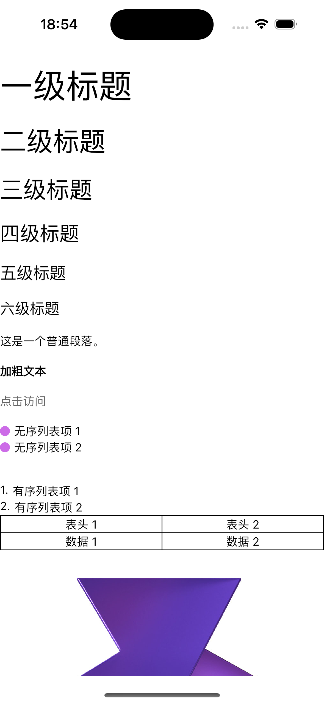
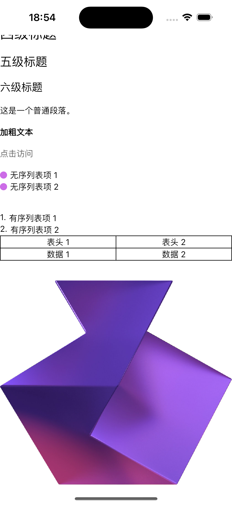

# RtText：Kotlin Multiplatform Compose HTML & Markdown 显示组件

RtText是Kotlin Multiplatform 库，支持多平台IOS、Android、Desktop。

[](https://kotlinlang.org) [](https://opensource.org/licenses/Apache-2.0) [](https://central.sonatype.com/artifact/cn.changjiahong/RtText)

   

## 示例


 
 

 

## 计划

- [ ] 完善Html标签支持
- [ ] 支持Markdown显示

RtText目前支持的HTML标签有：`h1`,`h2`,`h3`,`h4`,`h5`,`h6`,`a`,`b`,`strong`,`ol`,`ul`,`p`,`img`,`table`

- CSS: RtText支持设置简单的CSS属性
- 扩展标签：RtText支持自定义标签

## 添加到项目

### RtText发布在Maven Central仓库


添加依赖项到`commonMain`. 最新版本 [](https://central.sonatype.com/artifact/cn.changjiahong/RtText)
```kotlin
implementation("cn.changjiahong:RtText:<version>")
```

## 快速开始

### 协议链接

```kotlin
    val license = "勾选即代表你同意本应用<a href=\"https://ex.license.com\"><b>使用协议</b></a>。"

    RtHtml(
        license,
        modifier = Modifier.fillMaxSize(),
        linkAction = { link ->
            openLink(link)
        }
    )
```

### 跳转注册

```kotlin
  val regsiter =
        "你还没有账号？点击跳转<a style=\" color:#ffdd0000\" href=\"register\"><b>注册</b></a>。"
        
   RtHtml(
        regsiter,
        modifier = Modifier.fillMaxSize(),
        linkAction = { tag ->
            when(tag){
                "register" -> goToRegister()
            }
        }
    )

```

### CSS风格
RtText默认提供了一组github风格CSS，你也可以自定义CSS。

```kotlin
val customCss = """
        .post-md
        {
            width: 100%;
            font-size: 16.8px;
            letter-spacing: 0;
        }
    
        .post-md h1,
        .post-md h2,
        .post-md h3,
        .post-md h4,
        .post-md h5,
        .post-md h6
        {
            color: #000;
            margin: 12px 0;
        }
        .post-md h1
        {
            font-size: 2.5rem;
            line-height: 1.2;
            padding: 24px 0;
        }
        .post-md h2
        {
            font-size: 2rem;
            line-height: 1.2;
            padding: 20px 0;
        }
        .post-md h3
        {
            font-size: 1.75rem;
            line-height: 1.2;
            padding: 18px 0;
        }
        .post-md h4
        {
            font-size: 1.5rem;
            line-height: 1.2;
            padding: 16px 0;
        }
        .post-md h5
        {
            font-size: 1.25rem;
            line-height: 1.2;
            padding: 14px 0;
        }
        .post-md h6
        {
            font-size: 1.125rem;
            line-height: 1.2;
            padding: 12px 0;
        }
        .post-md a
        {
            color: #666;
            box-shadow: 0 2px 0 #ccc;
            /* transition: color ease-in-out .65s, box-shadow ease-in-out .65s; */
        }
    """.trimIndent()

    RtHtml(
        html,
        css = customCss,
        modifier = Modifier.fillMaxSize().verticalScroll(rememberScrollState()),
        linkAction = {
            println(it)
        }
    )


```

### 自定义标签

#### 简单标签处理器

RtText默认支持的标签处理器`defaultNodeHandlers`，若要扩展新的处理器，则只需要实现`NodeHandler`并注册即可。

```kotlin

// 自定义blod标签，支持字体加粗显示
val blod = NodeHandler("blod") { node: Node ->
    val (spanStyle, paragraphStyle) = node.parseStyle()
    withStyle(style = SpanStyle(fontWeight = FontWeight.Bold).merge(spanStyle)) {
        appendChild(node)
    }
}

// nodeHandlers里注册blod
RtHtml(
        html,
        nodeHandlers = mutableListOf(blod).apply { addAll(defaultNodeHandlers) },
        modifier = Modifier.fillMaxSize().verticalScroll(rememberScrollState()),
        linkAction = {
            println(it)
        }
    )
```

#### 特殊标签处理器

RtText中若要绘制特殊显示，如`img`,`table`等标签，则可实现`InlineNodeProcessor`处理器。

```kotlin
// 代码块标签处理器
val code =
    InlineNodeProcessor("code") {
        val param: Param = Json.decodeFromString(it)
        val codeNode = Ksoup.parse(param.contentText).body().firstChild()!!
        Box(modifier = Modifier.fillMaxWidth().wrapContentHeight().background(Color.Yellow)) {
            Text(codeNode.outHtml())
        }
    }
```

如果需要改变内嵌控件的高度，则可调用`handlerContext.updateInlineContent()`更新
```kotlin
val density = LocalDensity.current.density
val fontScale = LocalDensity.current.fontScale
val handlerContext = LocalHandlerContext.current

Box(modifier = Modifier
    .onSizeChanged { size ->
        handlerContext.updateInlineContent(
            param, (size.width / density * fontScale).sp,
            (size.height / density * fontScale).sp,
        )
}){
    Text("")
}
```

## 依赖
RtText依赖以下lib，如果你使用了RtText，则不需要再重复添加该库
- [ksoup](https://github.com/fleeksoft/ksoup) 0.2.2
- [landscapist-coil3](https://github.com/skydoves/landscapist) 2.4.7

## 贡献

有关使用和一般查询的问题，请参考[GitHub Discussions](https://github.com/ChangJiahong/RtText/discussions)。

如果您希望贡献，请阅读[贡献指南](CONTRIBUTING.md)。

要报告任何问题，请访问我们的[GitHub Issues](https://github.com/ChangJiahong/RtText/issues)，请确保在提交新问题之前检查重复项。


## 觉得此存储库有用？

通过加入此存储库的 __[stargazers](https://github.com/ChangJiahong/RtText/stargazers)__  来支持它。⭐


也可以 __[Follow Me](https://github.com/ChangJiahong)__ 一起创作吧！🤩


## License

    Copyright 2025 ChangJiahong

    Licensed under the Apache License, Version 2.0 (the "License");
    you may not use this file except in compliance with the License.
    You may obtain a copy of the License at

       http://www.apache.org/licenses/LICENSE-2.0

    Unless required by applicable law or agreed to in writing, software
    distributed under the License is distributed on an "AS IS" BASIS,
    WITHOUT WARRANTIES OR CONDITIONS OF ANY KIND, either express or implied.
    See the License for the specific language governing permissions and
    limitations under the License.

